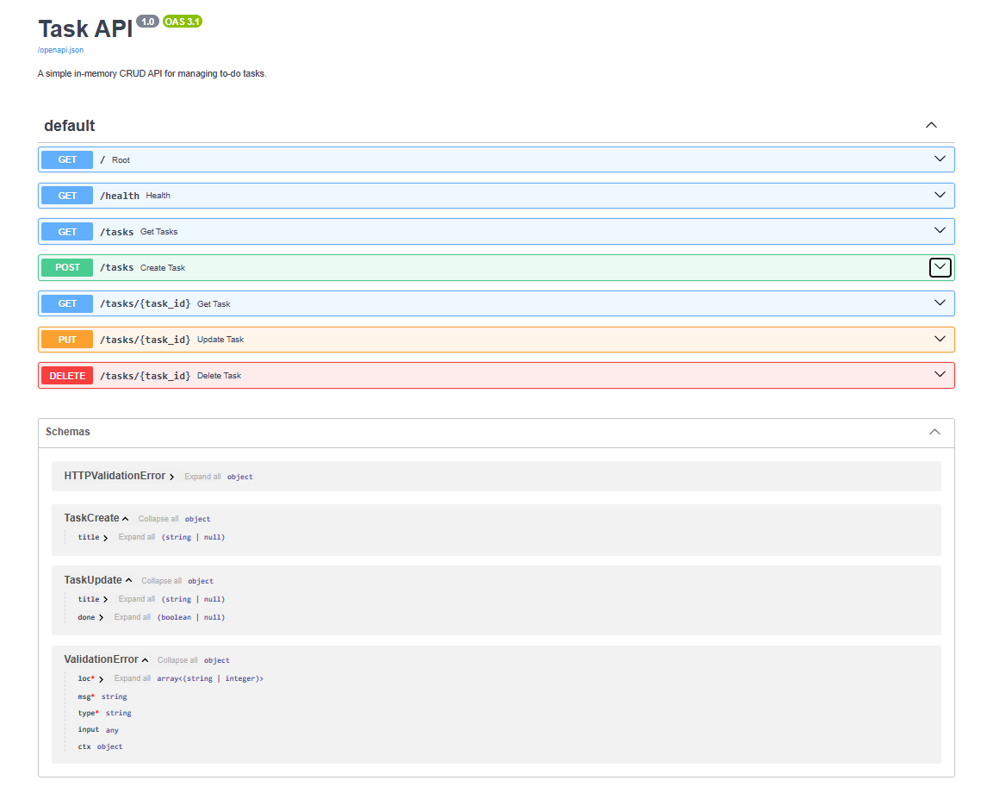

# Task API

A simple in-memory CRUD API for managing a to-do list, built with **Python** and **FastAPI**.

This project was built for the FlyRank Internship — Backend Track, Week 2, Assignment A1.

## What it is

The API lets a client create, read, update, and delete tasks. Each task has:

- `id` — number
- `title` — text
- `done` — true/false

Data is stored **in memory only** — it resets whenever the server restarts. There is no database yet.

## How to install

1. Clone this repository:
```bash
   git clone https://github.com/Martin-Nabil/flyrank-task-api.git
   cd flyrank-task-api
```

2. Create and activate a virtual environment:
```bash
   python -m venv venv
   venv\Scripts\Activate.ps1      # Windows (PowerShell)
   source venv/bin/activate       # macOS/Linux
```

3. Install dependencies:
```bash
   pip install fastapi uvicorn
```

## How to run

```bash
uvicorn main:app --reload --port 8000
```

The server will start at `http://localhost:8000`.

Interactive Swagger UI docs are available at: http://localhost:8000/docs

## Endpoints

| Method | Path | Description | Success | Errors |
|---|---|---|---|---|
| GET | `/` | API info | 200 | — |
| GET | `/health` | Health check | 200 | — |
| GET | `/tasks` | List all tasks | 200 | — |
| GET | `/tasks/{id}` | Get a single task | 200 | 404 if not found |
| POST | `/tasks` | Create a new task | 201 | 400 if title missing/empty |
| PUT | `/tasks/{id}` | Update a task's title and/or done status | 200 | 404 if not found, 400 if title empty |
| DELETE | `/tasks/{id}` | Delete a task | 204 | 404 if not found |

## Example request

Create a new task:

```bash
curl -i -X POST http://localhost:8000/tasks -H "Content-Type: application/json" -d "{\"title\":\"Buy milk\"}"
```

Example response: 
HTTP/1.1 201 Created
content-type: application/json

{"id":4,"title":"Buy milk","done":false}

## Swagger UI

Full endpoint list:



Successfully executing a request via "Try it out":


## Notes

- Data is stored in memory using a plain Python list — it resets on every server restart. This is expected for this stage of the project; persistent storage (a database) is planned for a later assignment.