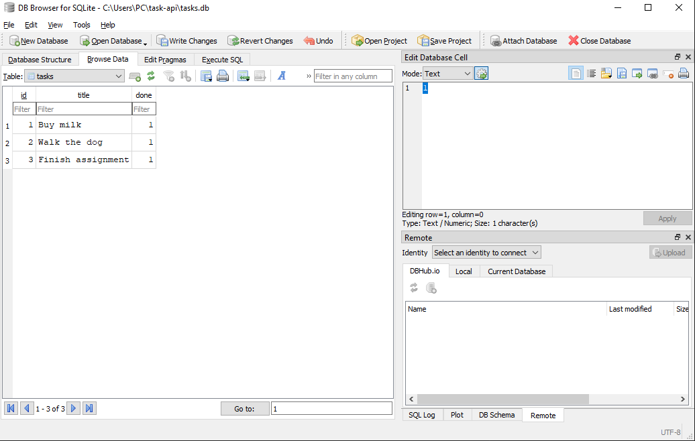
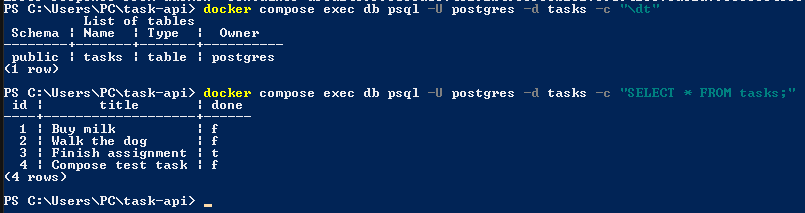

# Task API

A simple in-memory CRUD API for managing a to-do list, built with **Python** and **FastAPI**.

This project was built for the FlyRank Internship — Backend Track, Week 2, Assignment A1.

## What it is

The API lets a client create, read, update, and delete tasks. Each task has:

- `id` — number
- `title` — text
- `done` — true/false

Data is stored in a local SQLite database (tasks.db), so it survives server restarts.
The database and table are created automatically on first run.
## How to install

1. Clone this repository:
```bash
   git clone https://github.com/Martin-Nabil/flyrank-task-api.git
   cd flyrank-task-api
```

2. Create and activate a virtual environment:
```bash
   python -m venv venv
   venv\Scripts\Activate.ps1      # Windows (PowerShell)
   source venv/bin/activate       # macOS/Linux
```

3. Install dependencies:
```bash
   pip install fastapi uvicorn
```

## How to run

```bash
uvicorn main:app --reload --port 8000
```

The server will start at `http://localhost:8000`.

Interactive Swagger UI docs are available at: http://localhost:8000/docs

## Endpoints

| Method | Path | Description | Success | Errors |
|---|---|---|---|---|
| GET | `/` | API info | 200 | — |
| GET | `/health` | Health check | 200 | — |
| GET | `/tasks` | List all tasks | 200 | — |
| GET | `/tasks/{id}` | Get a single task | 200 | 404 if not found |
| POST | `/tasks` | Create a new task | 201 | 400 if title missing/empty |
| PUT | `/tasks/{id}` | Update a task's title and/or done status | 200 | 404 if not found, 400 if title empty |
| DELETE | `/tasks/{id}` | Delete a task | 204 | 404 if not found |

## Example request

Create a new task:

```bash
curl -i -X POST http://localhost:8000/tasks -H "Content-Type: application/json" -d "{\"title\":\"Buy milk\"}"
```

Example response: 
HTTP/1.1 201 Created
content-type: application/json

{"id":4,"title":"Buy milk","done":false}

## Swagger UI

Full endpoint list:


Successfully executing a request via "Try it out":


## Notes

- Data is stored in memory using a plain Python list — it resets on every server restart. This is expected for this stage of the project; persistent storage (a database) is planned for a later assignment.
## Database

This project now uses **SQLite** instead of in-memory storage.

Why SQLite:
- Single file — no separate database server to install or run
- Zero setup — the database and table are created automatically on first run
- Data survives restarts, unlike Assignment 1's in-memory list

Where it lives:
- `tasks.db` is created automatically in the project root the first time the app starts
- It is **git-ignored** — each fresh clone starts with a clean database, auto-seeded with 3 example tasks
- No manual database setup is required; just run the app

### Start command

```bash
uvicorn main:app --reload --port 8000
```

This single command creates `tasks.db`, creates the `tasks` table if missing, and seeds 3 example tasks if the table is empty.

### DB Browser for SQLite



### Example manual SQL query

```sql
UPDATE tasks SET done = 1;
```

Marks every task as completed at once. Run through DB Browser's Execute SQL tab and "Write Changes," this change was visible immediately through `GET /tasks` — no server restart needed, since the API and DB Browser read the same `tasks.db` file.

## Database (Postgres in Docker)

This project now uses **PostgreSQL running in a Docker container** instead of SQLite, and the whole stack (app + database) starts with a single command via Docker Compose.

### Run everything with one command

```bash
cp .env.example .env
docker compose up
```

This builds the app image, starts Postgres, waits for it to be healthy, then starts the API. The `tasks` table and 3 example rows are created automatically on first run.

### Environment variables

See `.env.example` for the required variable: DATABASE_URL=postgres://postgres:dev@db:5432/tasks

Copy `.env.example` to `.env` before running — `.env` is git-ignored and never committed, since it can hold real secrets.

### Why Postgres + Docker

- No manual Postgres install — Docker runs the official image
- Same setup works identically on any machine
- A named volume (`taskdata`) keeps data across `docker compose down` / `up` cycles
- Config (the database password) lives in `.env`, never hardcoded in source

### Database screenshot



## Authentication (Supabase)

This project uses **Supabase Auth** for user signup, login, logout, and protected routes. Supabase handles password hashing and JWT (JSON Web Token) issuance — this app never touches raw passwords or signs its own tokens.

### Setup

Add these to your `.env` (see `.env.example`):
SUPABASE_URL=your_supabase_project_url
SUPABASE_KEY=your_supabase_anon_key

Get these from your Supabase project dashboard under **Project Settings → API**. Use the **anon/public key**, never the `service_role` key.

### Auth endpoints

| Method | Path | Description | Auth required |
|---|---|---|---|
| POST | `/auth/signup` | Create a new account | No |
| POST | `/auth/login` | Log in, returns an access token | No |
| POST | `/auth/logout` | Log out the current session | Yes |
| GET | `/public/info` | Open info endpoint | No |
| GET | `/protected/profile` | Get the logged-in user's profile | Yes |
| GET | `/protected/dashboard` | Example second protected route | Yes |

### How protection works

Protected routes require an `Authorization: Bearer <token>` header. The token is verified against Supabase on every request via a shared `require_user` dependency — if the token is missing, malformed, or invalid/expired, the request is rejected with `401` before it reaches the route's logic.

### Example: signup then access a protected route

curl -X POST http://localhost:8000/auth/login \
  -H "Content-Type: application/json" \
  -d '{"email":"you@example.com","password":"yourpassword"}'

curl http://localhost:8000/protected/profile \
  -H "Authorization: Bearer <access_token_from_above>"
